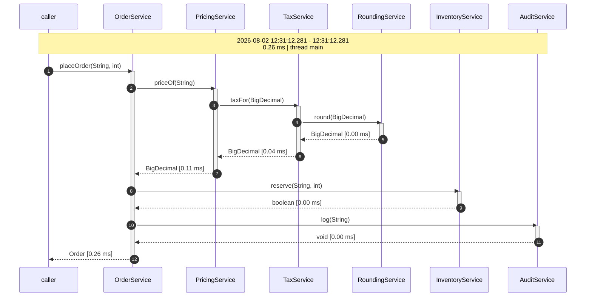
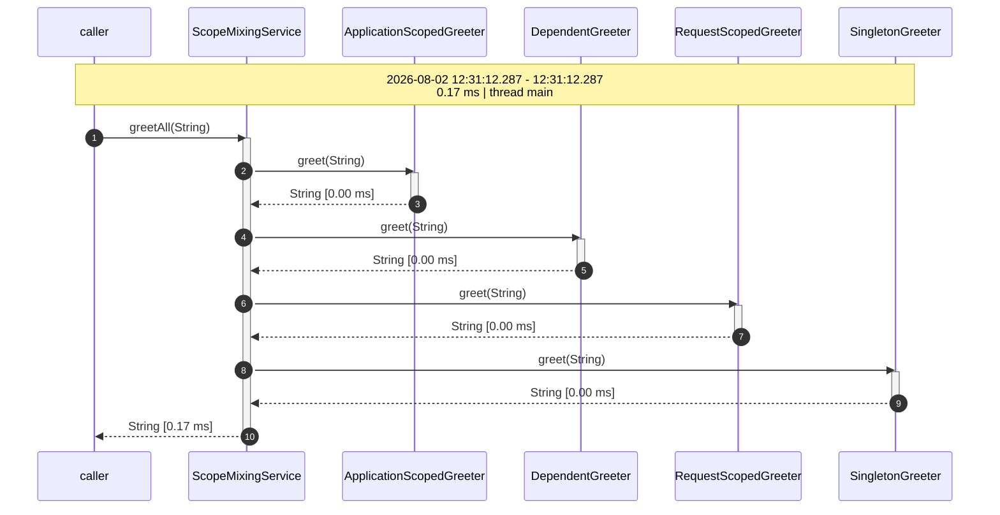
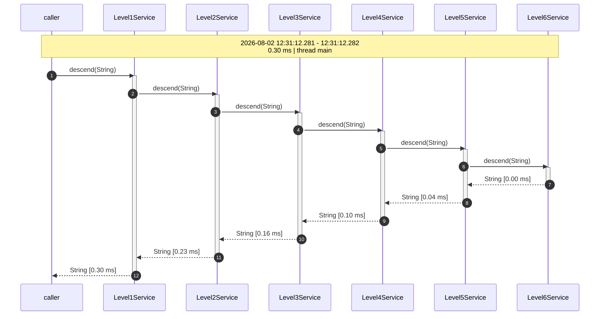
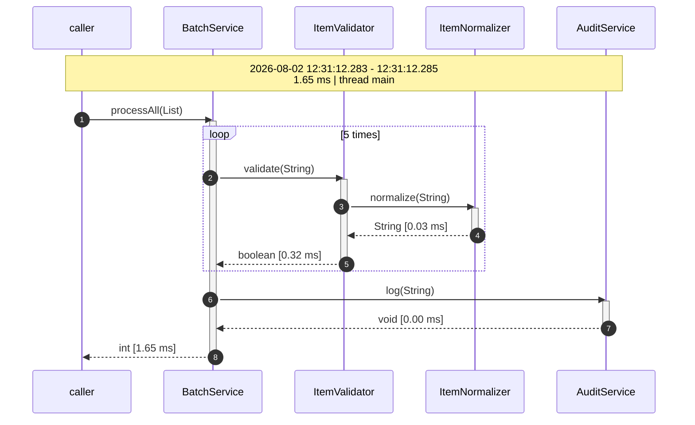
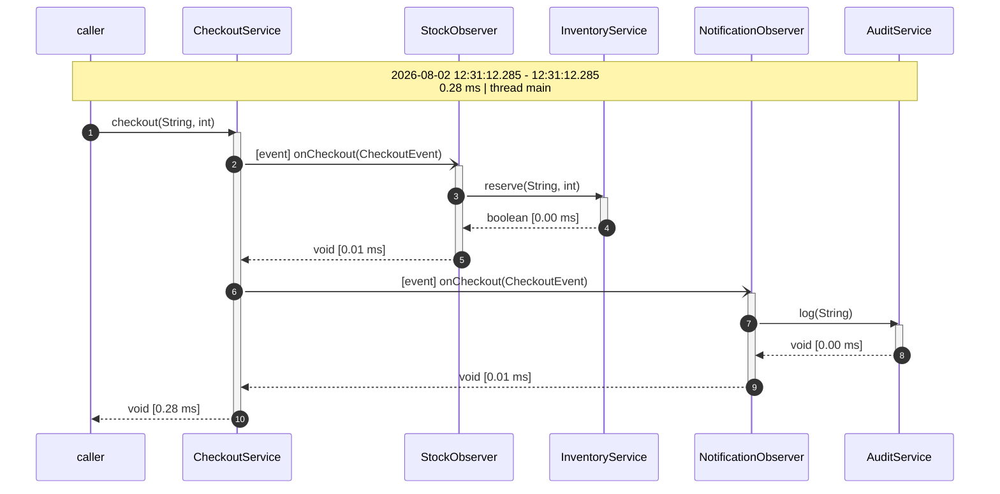
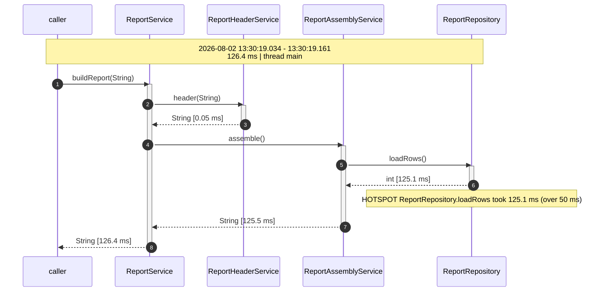

# cdi-flow

A **portable CDI extension** which applies a recording interceptor to your beans while the
container boots, records every public method-call of the resulting call-chain, and writes the chain
out as a sequence-diagram as soon as the outermost call returns - as **Mermaid** by default or as
**PlantUML**, selected with a single configuration property.

No annotation on your beans. No code change. Put the jar on the class-path and you get diagrams.

> [!IMPORTANT]
> **This is a development tool, not something to run in production.**
>
> It is meant for exercising a *single part* of an application - from a test, or by triggering one
> entry-point manually - to see what that part actually does at runtime. Recording every public
> method-call of every bean means an interceptor on every bean, a growing call-tree per thread and
> a file written per outermost call. That is fine for one scenario at a time and entirely
> unsuitable for a production workload.
>
> If it does end up on a production class-path, disable it there with `cdi-flow.enabled=false`.



`OrderService#placeOrder(..)`, recorded by `DiagramShowcaseIT`. Every diagram in this README is a
generated file copied as it is - nothing here is hand-drawn. Only the timestamps and durations
differ from run to run. They are written to
`cdi-flow-examples/*/target/flow-diagrams/<container>/showcase/`.

## Example diagrams

### The simple case

One bean calling four others - `ScopeMixingService#greetAll(..)`. The four callees are
`@ApplicationScoped`, `@Dependent`, `@RequestScoped` and a stereotyped `@Singleton`, which the
container proxies very differently. None of that shows: four plain lanes.



### The complex case

`Level1Service#descend(..)` - six levels of nesting across seven lanes, from one single call into
the outermost bean. Only that outermost call writes a file; the five nested ones are recorded into
the same chain. The activation bars nest accordingly, and the durations add up from the inside out.



## Modules

| Module | Content |
|---|---|
| `dynamic-cdi-flow-renderer` | the extension. Compiled against **the CDI API/SPI only** - it contains no reference to Weld, to OpenWebBeans or to any other implementation. Its only dependencies are `jakarta.enterprise.cdi-api` and - optionally - `microprofile-config-api`, both `provided` |
| `cdi-flow-lite` | the same recorder, attached while the application is **built**, for a container which resolves its beans then and never runs a portable extension |
| `cdi-flow-jaxrs` | one request-filter: it reads the use-case a caller names in a header and labels everything recorded during that request with it |
| `cdi-flow-quarkus` | the Quarkus extension - one dependency, and an application records the use-cases driven through it |
| `cdi-flow-examples` | aggregator of the example-applications |
| `cdi-flow-examples-beans` | the example CDI beans and the container-bootstrapping test-support every example reuses. A shared library, not an example - it carries no cdi-flow configuration of its own |
| `cdi-flow-examples-quarkus-crud` | the drop-in on Quarkus: a CRUD application whose use-cases are recorded while a browser drives them |
| `cdi-flow-examples-jakarta-crud` | the very same application deployed to a Jakarta EE server (TomEE), for comparison |
| `skills` | a [Claude Code skill](skills/README.md) teaching the addon to Claude - which module a container needs, how to select beans, how to label a use-case, and how to read the recordings back |

## Recording use-cases, not just calls

A flow ends when its outermost call returns, and a request is an outermost call on a thread of its
own - so one browser-driven use-case produces a series of flows rather than one. Labelling ties that
series together:

```ts
// the whole integration on the test side
await context.setExtraHTTPHeaders({ 'X-Flow-Label': testInfo.title });
```

Every flow started while such a request is handled is filed under that use-case. The header is read
by `cdi-flow-jaxrs` - and by the Quarkus extension, which registers that filter itself.

Nothing needs to be an HTTP request, though. A test or a `main` naming the use-case in process gets
the same grouping, which is the whole of the API:

```java
FlowLabel.set("an order is placed");   // FlowLabel.set(name, description) for a description as well
try {
    orderService.placeOrder("ACME-1", 3);
} finally {
    FlowLabel.clear();
}
```

The label is held per thread and read when a flow **starts**, not when it is published - so a flow
that outlives the label, an asynchronous observer say, keeps the one it began with.

Either way, the addon writes what a reviewer actually wants:

```
<output-directory>/
├── use-cases.md                    every use-case, with its diagram inline
└── <the use-case>/
    ├── use-case.mmd                the whole use-case, one block per request
    ├── README.md                   the chains it is made of, and how often each occurred
    └── <EntryPoint>_<method>_….mmd  one file per distinct chain
```

Every diagram of a labelled flow is **titled with its use-case** - the single chains as well as the
combined one - so a diagram copied out of a directory still says what it belongs to. A flow with no
label gets no title, which is what keeps the output of an application that records no use-cases
exactly as it was - and `cdi-flow.title-diagrams=false` leaves it off everywhere, for a diagram meant
to be pasted somewhere that supplies its own heading.

Identical chains - same participants, same calls, different microseconds - are collapsed to one
file and counted, because a use-case checks the session before every request and reads the same list
four times. `cdi-flow.combined-exclude-pattern` keeps a named entry-point out of the combined diagram
without dropping it from the recording.

One application serves a whole suite this way: no restart per use-case, and nothing to configure per
test.

**The same demo exists twice**, so that "the same way on either container" is a claim you can check
rather than take: a CRUD application - same beans, same Angular front-end, same four Playwright
specs, one `./run.sh` each - on Quarkus and on Weld.

| Example | Stack | Its cdi-flow integration |
|---|---|---|
| [`cdi-flow-examples-quarkus-crud`](cdi-flow-examples/cdi-flow-examples-quarkus-crud) | Quarkus, Quinoa | one dependency, two configuration lines, nothing in the sources |
| [`cdi-flow-examples-jakarta-crud`](cdi-flow-examples/cdi-flow-examples-jakarta-crud) | TomEE embedded: Tomcat, OpenWebBeans, CXF | two dependencies and three configuration defaults - an include-pattern among them, because a server has beans of its own |

Either of them records in the other notation on request - `./run.sh --format plantuml` - and the
combined diagram of a use-case is stitched in whichever was asked for.

Driven through both and with the timings and thread-names normalized away, the combined diagrams are
identical for **all four** use-cases, line for line - one runtime resolving its beans while it builds
the application, the other deploying a web application into a servlet container, and the recording
saying the same thing about both.

### Dropping it into an application

| Container | What it takes |
|---|---|
| **Quarkus** | `cdi-flow-quarkus` as a dependency. It attaches the recorder to the beans of *the application archive* while Quarkus builds, registers the label-filter, arms the recorder at startup and collects the observer-methods so events stay events. Records in dev-mode and in tests with no configuration at all; a production build has to say `cdi-flow.enabled=true` in as many words |
| **Weld, OpenWebBeans** | the jar, as before - the portable extension does the attaching. Add `cdi-flow-jaxrs` for the label-filter if the application serves REST |
| **Another CDI-Lite container** | `cdi-flow-lite`, whose build compatible extension attaches the binding. Narrow it with `cdi-flow.include-pattern`: without one, every eligible bean the index holds is recorded |

Whatever attaches the binding, the recorder **arms itself on the first call it sees** if nothing armed
it - which is what makes an integration nothing more than the binding.

### One example per configuration

The examples are separate Maven projects rather than one module with many test-configurations.
Each of them brings **its own `META-INF/microprofile-config.properties`**, so every example is a
self-contained application showing one realistic setup - and no example has to work around the
configuration of another.

All of them are named `cdi-flow-examples-<name>`:

| Example | `microprofile-config.properties` | shows |
|---|---|---|
| `record-all` | *(nothing configured)* | the default: drop the addon on the class-path and every eligible bean is recorded. Holds the behavioural tests |
| `by-pattern` | `include-pattern`, `exclude-pattern` | selecting beans by class-name, and vetoing some again |
| `by-stereotype` | `include-stereotypes` | selecting beans by CDI stereotype, with no pattern involved |
| `by-pattern-or-stereotype` | `include-pattern` + `include-stereotypes` | the union - a bean qualifies through either one |
| `plantuml` | `output-format` | the same recordings in the other notation |
| `hotspots` | `hotspot-threshold-ms` | pointing out the call which is actually slow |

Tests that demonstrate an example's headline configuration boot with **no overrides at all**, which
is what proves the properties-file drives the behaviour. Tests exploring variations of it override
single values through system-properties - ordinary MicroProfile-Config precedence, covered by
`MicroProfileConfigIT`.

The base package is `org.os890.cdi.uml.dynamic.flow.renderer`; the application-facing types live
in its `api` and `config` sub-packages.

```xml
<dependency>
    <groupId>org.os890.cdi.uml</groupId>
    <artifactId>dynamic-cdi-flow-renderer</artifactId>
    <version>1.0.0-SNAPSHOT</version>
</dependency>
```

> [!IMPORTANT]
> **This is not released anywhere yet.** `1.0.0-SNAPSHOT` is resolved from your local repository,
> so the dependency above only works once you have built the project yourself:
>
> ```bash
> git clone https://github.com/os890/dynamic-cdi-flow-renderer.git
> cd dynamic-cdi-flow-renderer
> mvn clean install -DskipTests     # leave -DskipTests off to run the suite as well
> ```

## Build and run

**What you need:** a JDK and Maven for the addon itself - and, for the two CRUD examples only,
**Node.js with pnpm** and the Playwright browsers they drive.

```bash
mvn clean install             # the addon, the examples, and the whole test-suite

./run-all-containers.sh       # both containers, keeps the diagrams of both

mvn clean install -Pweld      # Weld 6.0.1.Final   (default profile)
mvn clean install -Powb       # OpenWebBeans 4.1.0

ls cdi-flow-examples/*/target/flow-diagrams/weld/showcase/
```

`mvn install` at the root comes first, and not only for the addon: the two CRUD examples are built
and run **standalone** by their own `./run.sh`, which resolves `cdi-flow-quarkus` respectively
`dynamic-cdi-flow-renderer` from the local repository. Without that install they cannot resolve the
addon at all.

Compiled with `--release 17`, tested on JDK 25. CDI 4.1 (`jakarta.enterprise.cdi-api:4.1.0`).

The `validate` phase of every module runs `apache-rat-plugin`. A source-file without an Apache-2.0
header fails the build before anything is compiled, and the report names the file it found -
so the headers cannot quietly rot away.

## Rendering the diagrams to PNG

```bash
./render-diagrams.sh             # the showcase directories of both containers, both formats
./render-diagrams.sh --all       # every diagram the suite produced
./render-diagrams.sh <directory> # every diagram below that directory
```

Writes a `.png` next to every `.mmd` (via the `mermaid-cli` image) and every `.puml` (via the
`plantuml` image). All files below one directory are rendered in a **single** container run -
starting a container plus a headless browser, respectively a JVM, per file would cost far more
than the rendering itself.

This one needs a **container runtime** - `podman` by default. Override the defaults with
`MERMAID_IMAGE`, `PLANTUML_IMAGE` and `CONTAINER_RUNTIME` (e.g. `docker`) if needed. Nothing else in
the project renders anything, so a missing runtime costs you the PNGs and nothing more: Mermaid
renders on GitHub as it is.

## Configuration

Everything is optional. Read once while the container boots, through MicroProfile-Config when it
is available and through system-properties / environment-variables otherwise - so the
MicroProfile-Config dependency is genuinely optional.

| Property | Default | Meaning |
|---|---|---|
| `cdi-flow.enabled` | `true` | master switch - `false` keeps the extension completely out of the way |
| `cdi-flow.include-pattern` | *(unset)* | regex on the fully qualified bean-class-name |
| `cdi-flow.include-stereotypes` | *(unset)* | comma-separated CDI stereotypes; a bean carrying one of them is recorded |
| `cdi-flow.exclude-pattern` | *(unset)* | regex which removes a bean again, whatever selected it |
| `cdi-flow.output-directory` | `java.io.tmpdir` | where the diagram files are written, created on demand |
| `cdi-flow.output-format` | `mermaid` | notation: `mermaid` (`.mmd`) or `plantuml` (`.puml`) |
| `cdi-flow.hotspot-threshold-ms` | *(unset)* | mark calls taking longer than this many milliseconds |
| `cdi-flow.fold-loops` | `true` | render repeated identical calls as a `loop N times` block |
| `cdi-flow.collapse-proxy-frames` | `true` | safety-net against duplicated frames (see below) |
| `cdi-flow.write-files` | `true` | `false` records into registered sinks only |
| `cdi-flow.file-header` | *(unset)* | a line put in front of every generated file as a comment of the notation in use - a licence header, so a build insisting on one needs no exclusion |

### Use-cases and the report

These decide what a **labelled** flow turns into; they do not change what is recorded. See
[Recording use-cases](#recording-use-cases-not-just-calls).

| Property | Default | Meaning |
|---|---|---|
| `cdi-flow.label-header` | `X-Flow-Label` | the request-header naming the use-case, read by `cdi-flow-jaxrs` |
| `cdi-flow.description-header` | `X-Flow-Description` | the request-header describing it |
| `cdi-flow.group-by-label` | `true` | `false` files a labelled flow as a plain single diagram, exactly like an unlabelled one, instead of into a use-case directory |
| `cdi-flow.report` | `true` | `false` writes the same plain single files and no `use-cases.md` |
| `cdi-flow.title-diagrams` | `true` | `false` leaves the use-case off as the diagram's title, everywhere |
| `cdi-flow.max-combined-requests` | `25` | above this many requests, `use-cases.md` links a use-case's combined diagram instead of inlining it. What is recorded and written is not capped |
| `cdi-flow.combined-exclude-pattern` | *(unset)* | regex matched in full against `<EntryPoint>.<method>` - `.*\.list` say - keeping that call out of the combined diagram without dropping it from the recording |

Environment-variables use the usual mapping: `cdi-flow.output-directory` →
`CDI_FLOW_OUTPUT_DIRECTORY`.

### Selecting the beans to record

`include-pattern` and `include-stereotypes` are two **alternative selectors**. Each works on its
own, and a bean is recorded as soon as **one** of them applies:

| `include-pattern` | `include-stereotypes` | recorded |
|---|---|---|
| unset | unset | **every bean** - the default |
| set | unset | beans whose name matches |
| unset | set | beans carrying one of the stereotypes |
| set | set | the **union**: name matches **or** a stereotype is present |

`exclude-pattern` is not part of that union. It is a veto and removes a bean again, no matter
which selector picked it.

```properties
# only the beans of one package
cdi-flow.include-pattern=com\\.acme\\.order\\..*

# only the beans marked as a service, wherever they live
cdi-flow.include-stereotypes=com.acme.Service

# both: everything under com.acme.order, plus every @Service anywhere else
cdi-flow.include-pattern=com\\.acme\\.order\\..*
cdi-flow.include-stereotypes=com.acme.Service
```

Because the two form a union, an `include-pattern` of `.*` already selects every bean and makes a
stereotype next to it pointless - leave the pattern unset to let the stereotypes decide.

**Stacked stereotypes count.** The annotations of a bean are resolved transitively, so a bean
carrying `@AuditedReadOnlyService`, which is itself annotated `@Service`, is selected by
`include-stereotypes=com.acme.Service`. Fully qualified names are recommended; a simple name
(`Service`) is accepted as a convenience. A configured name which is not on the class-path or not
actually a CDI stereotype is reported with a warning at boot - a typo would otherwise silently
record nothing at all.

## Output format

Mermaid is the default. `cdi-flow.output-format=plantuml` switches the notation - and nothing
else: which calls are recorded, how they nest, how loops fold and how names are cleaned is decided
by the same code for both. A unit-test compares the two outputs after normalizing the
arrow-tokens away, so they cannot drift apart.

```
@startuml
autonumber
hide footbox
participant "caller" as Caller
participant BatchService
participant ItemValidator
participant ItemNormalizer
participant AuditService
note over Caller, AuditService
    2026-08-02 11:18:28.234 - 11:18:28.234
    0.11 ms | thread main
end note
Caller -> BatchService : processAll(List)
activate BatchService
    loop 5 times
        BatchService -> ItemValidator : validate(String)
        activate ItemValidator
            ItemValidator -> ItemNormalizer : normalize(String)
            activate ItemNormalizer
            ItemNormalizer --> ItemValidator : String [0.00 ms]
            deactivate ItemNormalizer
        ItemValidator --> BatchService : boolean [0.02 ms]
        deactivate ItemValidator
    end
    BatchService -> AuditService : log(String)
    activate AuditService
    AuditService --> BatchService : void [0.00 ms]
    deactivate AuditService
BatchService --> Caller : int [0.11 ms]
deactivate BatchService
@enduml
```

| | Mermaid | PlantUML |
|---|---|---|
| call | `A->>B: m()` | `A -> B : m()` |
| return | `A-->>B: T [1 ms]` | `A --> B : T [1 ms]` |
| exception | `A--xB: throws E` | `A -->x B : throws E` |
| observer notification | `A-)B: [event] m(E)` | `A ->> B : [event] m(E)` |
| file extension | `.mmd` | `.puml` |

Accepted values are case-insensitive and include the usual short forms (`mmd`, `puml`, `uml`).
An unknown value logs a warning and falls back to Mermaid rather than breaking the boot.

Independently of the configured format, a recorded `CallFlow` can always be rendered as either:
`flow.toDiagram()` (configured), `flow.toMermaid()`, `flow.toPlantUml()`.

## File names

```
<simple class-name of the entry-point>_<first public method>_<start>_<end><extension>

OrderService_placeOrder_20260802-105533833_20260802-105533834.mmd
OrderService_placeOrder_20260802-105533833_20260802-105533834.puml
```

The entry-point is the bean which triggered the *first* interceptor-call. Method-parameters are
not part of the name. Two flows finishing in the same millisecond get a `-1`, `-2`, … suffix
instead of overwriting each other.

## What it handles

### Loops

Consecutive identical calls - including their whole sub-tree - fold into one block.
Switch it off with `cdi-flow.fold-loops=false` to get all five iterations.



### CDI events

A synchronous event is delivered on the firing thread, so its observers belong to the same
call-chain. Observer-methods are recognized during `ProcessAnnotatedType` and drawn with an
event-arrow (`-)`) instead of a plain call-arrow.



`fireAsync` is delivered on a container-managed worker-thread. A recorded flow belongs to exactly
one thread, so the asynchronous observer gets a **diagram of its own** rather than being nested
into the firing method. That is deliberate and covered by `AsynchronousEventFlowIT`.

### Exceptions

Every frame the exception travelled through is marked, and the diagram is still written.

```
FailingService--xFailingOrchestrator: throws IllegalStateException [0.06 ms]
FailingOrchestrator--xCaller: throws IllegalStateException [0.17 ms]
```

The call which succeeded before the failure keeps its ordinary return-arrow, so a diagram shows
how far the chain got.

### Hotspots

`cdi-flow.hotspot-threshold-ms` points out the calls which took too long. Marking *every* slow
frame would be useless: a caller is slow whenever its callee is, so the marker would run all the
way down the path. Two rules cut it down to the frame worth opening:

* the **outermost call is never marked** - it contains everything and is slow by construction
* a slow frame is only marked when **nothing below it is slow as well**, so the marker sits on the
  innermost still-slow call of the branch

Below, `buildReport` (126.4 ms) and `assemble` (125.5 ms) both exceed the 50 ms threshold, and
neither is marked - the time is spent in `loadRows`:



A branch which is slow for two independent reasons gets one marker per reason. The flag is part of
the recorded model (`CallNode#isHotspot()`), so a custom `FlowSink` can act on it instead of
reading the diagram.

Two consequences worth knowing: a call has to be **strictly longer** than the threshold, and an
outermost call which is slow entirely on its own produces **no marker at all** - there is no inner
frame to point at. Both are pinned by tests.

### Recursion

Recursion is kept, level by level, as nested activations of a single participant - see below for
why that is not entirely trivial.

### Clean names

Both containers put generated classes into the call-chain: client-proxies for normal-scoped beans
and interceptor-subclasses for intercepted beans. None of that reaches the diagram.

* `ProxyNames` maps the runtime class back to the class you wrote, by walking up the hierarchy
  while the class looks generated. A class counts as generated when it is synthetic or hidden, is
  a `java.lang.reflect.Proxy`, has one of the usual markers in its name (`$$`, `$Proxy`,
  `_Subclass`, `_ClientProxy`, …) **or implements an interface whose name starts with
  `org.jboss.weld.` or `org.apache.webbeans.`**. That last rule catches the implementation-specific
  marker-interfaces without the addon having to reference them - it is matched by name.
* `Instrumentability` never adds the binding to a generated, synthetic or infrastructure class in
  the first place, which is what actually prevents duplicated frames.
* `ProxyFrameCollapser` is the safety-net on top: it removes a frame which forwards the very same
  call to the very same bean-class without doing any work of its own.

**Measured, not assumed:** re-running the whole suite with
`cdi-flow.collapse-proxy-frames=false` produces byte-identical diagrams on both containers.
Neither Weld 6.0.1 nor OpenWebBeans 4.1.0 duplicates a frame here - the collapser never fires. It
is kept as a documented safeguard, with its own unit-tests, not because it was needed.

The tricky part is that a proxy hop and real recursion look structurally identical: same bean,
same method, one child, no work of its own. They are told apart by the **target identity** -
a proxy hop means two different objects for one logical call, recursion re-enters the same
instance. `RecursionFlowIT` and `ProxyFrameCollapserTest` pin both directions.

### Beans which cannot be intercepted

A final class, a final business-method or a class without an accessible constructor cannot be
subclassed, so adding an interceptor-binding to it would turn a working deployment into a
`DeploymentException`. Those types are skipped silently (logged at `FINE`), together with
interceptors, decorators, extensions, records, enums, non-static inner classes and the
infrastructure packages of the container itself.

## Extending it

Implement `FlowSink` to do something else with a recorded flow:

```java
public interface FlowSink {
    void onFlowRecorded(CallFlow flow);
}
```

Register it statically via `FlowSinks.register(sink)` - which also works before the container is
booted - or simply make it a CDI bean; the extension picks those up during
`AfterDeploymentValidation`.

`CallFlow` gives you the whole tree (`CallNode`) plus `toDiagram()` for the configured notation and
`toMermaid()` / `toPlantUml()` when you want a specific one. Sinks are never recorded themselves:
the recorder suspends itself while publishing.

A sink which collected several flows can render them as **one** diagram - the same combined
rendering a use-case directory gets, without a label and without a file:

```java
String diagram = CombinedFlowDiagram.of(collectedFlows, DiagramFormat.MERMAID, "an order is placed");
```

One block per flow, in the order handed over, sharing the participant-lanes; `null` as the title
leaves the title off. Unlike the use-case report it neither collapses identical chains nor caps
their number - a caller passing the same chain twice gets two blocks, which is what an assertion
comparing a recording against an expected diagram needs.

## Known limitations

* **Self-invocation is not recorded.** `this.otherMethod()` never leaves the instance, so no
  interceptor runs for it - an inherent property of interceptor-based recording, not a bug.
  Whatever the self-called method calls further on still shows up, one level too high.
  `SelfInvocationIT` pins this behaviour.
* **A flow does not cross threads.** Each thread records its own flow. That keeps concurrent calls
  cleanly separated (`ConcurrentFlowsIT`) at the price of asynchronous events producing their own
  diagram.
* **Only public methods are recorded.** A class-level binding would also cover protected and
  package-private methods; they are filtered out at runtime, together with `equals`, `hashCode`,
  `toString` and everything declared by `Object`.
* **Beans created by producer-methods are not managed beans**, so the container never intercepts
  them. The producer-method itself is recorded.
* **Argument values are never recorded** - only parameter types. No `toString()` is called on your
  objects and no application data ends up in the files.

## Tests

`mvn clean install -Pweld` and `-Powb` run the same **229 tests** (140 unit-tests in the addon,
89 integration-tests spread over the example-projects) and both are green.

The addon module tests everything that needs no container: `MermaidSequenceRendererTest`,
`PlantUmlSequenceRendererTest`, `LoopFolderTest`, `ProxyNamesTest`, `ProxyFrameCollapserTest`,
`ParticipantNamerTest`, `DiagramFileNamerTest`, `FileFlowSinkTest`, `FlowConfigTest`,
`DiagramFormatTest`, `StereotypesTest`, `HotspotDetectorTest`, `InstrumentabilityTest`,
`FlowLabelTest`, `UseCaseReportSinkTest`, `CombinedFlowDiagramTest` and `DiagramWriterTest` - the
four last covering the labelling, the collapsing of identical chains, the combined diagram and the
generated document, the combined rendering handed to a caller, and the configured file-header.

The Quarkus extension is covered by the example instead of by a test-class of its own: `./run.sh` in
[`cdi-flow-examples-quarkus-crud`](cdi-flow-examples/cdi-flow-examples-quarkus-crud) is the check
that a single dependency really is enough, and it exercises the parts no unit-test can - the
binding attached at build-time, the filter registered by the extension, and the observer-methods
collected from the index.

Everything that needs a container lives in the example-project whose configuration it belongs to,
and runs once per CDI implementation:

**`cdi-flow-examples-record-all`** - no configuration, so these test the recording itself:

| Area | Test |
|---|---|
| no configuration at all - every bean recorded | `NoConfigurationIT` |
| basic recording, file output | `SimpleFlowIT` |
| six-level chain, outermost-only output | `DeeplyNestedFlowIT` |
| loop folding / no folding | `LoopFlowIT`, `UnfoldedLoopFlowIT` |
| synchronous / asynchronous events | `SynchronousEventFlowIT`, `AsynchronousEventFlowIT` |
| all four scopes, clean names, no duplicates | `ProxyCleanlinessIT` |
| recursion survives the de-duplication | `RecursionFlowIT` |
| exceptions | `ExceptionFlowIT` |
| concurrency | `ConcurrentFlowsIT` |
| file-naming scheme | `DiagramFileNamingIT` |
| the documented CDI limitation | `SelfInvocationIT` |
| non-proxyable beans do not break the deployment | `NonInstrumentableBeansIT` |
| the master switch, and a custom output-directory | `DisabledRecorderIT`, `OutputDirectoryConfigIT` |
| one Mermaid diagram per scenario, all validated | `DiagramShowcaseIT` |

**The configuration examples** - each running on its own `microprofile-config.properties`:

| Example | Test | Covers |
|---|---|---|
| `-by-pattern` | `IncludePatternConfigIT` | the include-pattern selects, beans outside it are never instrumented |
| `-by-pattern` | `ExcludePatternConfigIT` | the exclude-pattern vetoes a bean the include-pattern had selected |
| `-by-pattern` | `MicroProfileConfigIT` | the values really come from the file, and a system-property outranks it |
| `-by-stereotype` | `StereotypeConfigIT` | the stereotype selects on its own; stacked stereotypes, several at once, simple names, typos |
| `-by-pattern-or-stereotype` | `StereotypeAndPatternConfigIT` | the union - one test per arm, plus the case neither covers |
| `-plantuml` | `PlantUmlOutputIT` | the notation changes, the recording does not |
| `-plantuml` | `PlantUmlShowcaseIT` | one PlantUML diagram per scenario, all validated |
| `-hotspots` | `HotspotConfigIT` | the marker lands on the innermost slow call; one marker per slow branch; fast flows and self-slow entry-points stay unannotated |
| `-hotspots` | `HotspotShowcaseIT` | the annotated diagram shown above |

Every diagram produced anywhere in the suite is checked by `MermaidAssertions` respectively
`PlantUmlAssertions`: the syntax has to parse, activations and `loop`/`end` blocks have to
balance, every message has to reference a declared participant, and nothing may contain a
proxy-marker.

## License

[Apache License, Version 2.0](LICENSE). Every source-file carries the header, and
`apache-rat-plugin` keeps it that way - see [Build and run](#build-and-run).
