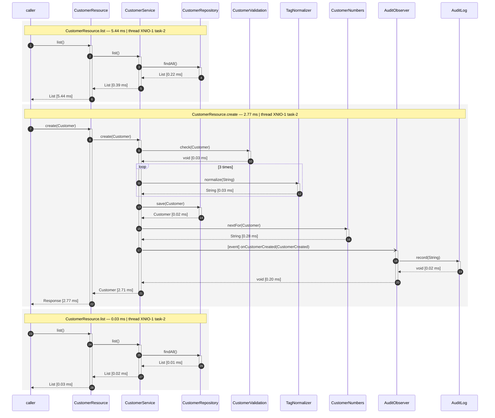
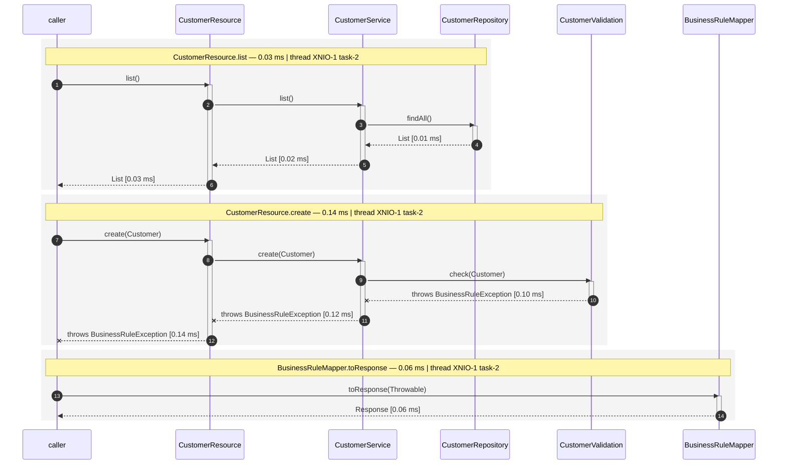
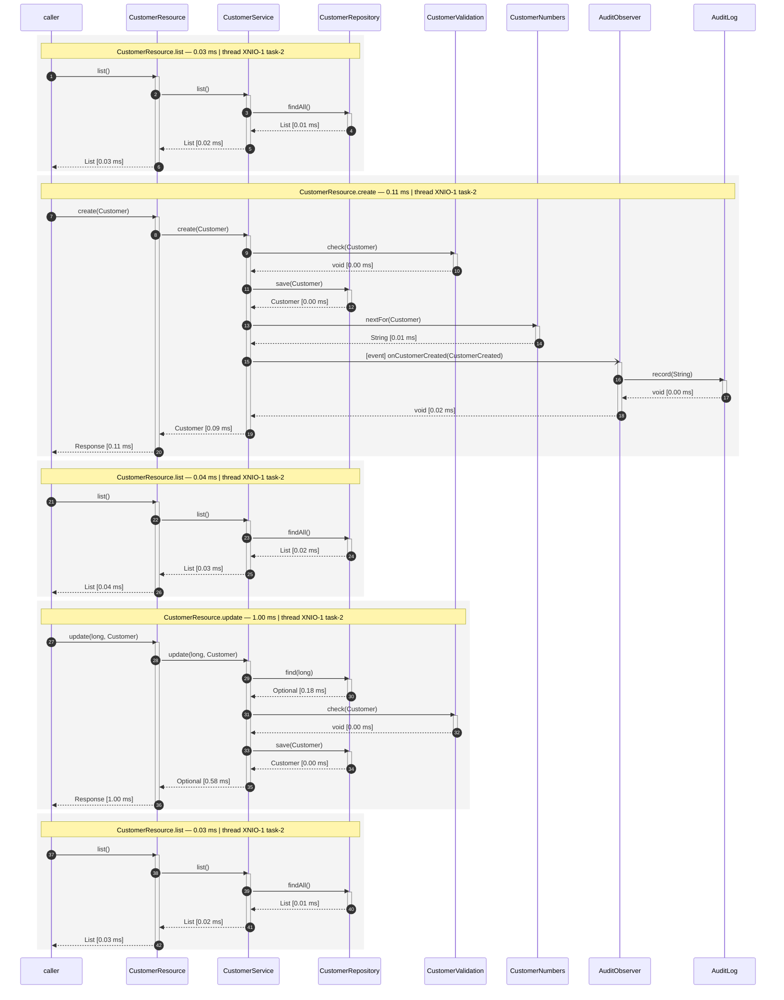
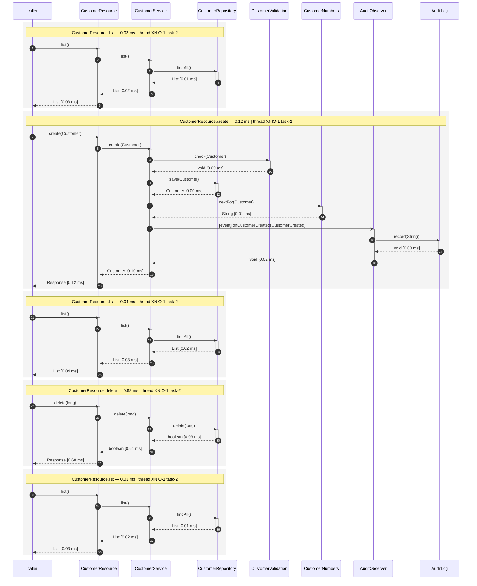

# The same demo on a plain Jakarta stack

Same beans, same Angular front-end, same Playwright suite as
[the Quarkus example](../cdi-flow-examples-quarkus-crud) — on **Weld SE with RESTEasy on Undertow**
instead of Quarkus. It exists to show that the addon is used the same way either side of that
choice, and that what it records does not depend on it.

```bash
./run.sh                      # build, drive the use-cases, and say where the diagrams are
./run.sh --format plantuml    # the same flows as .puml instead
open target/flow-diagrams/use-cases.md
```

## What this application does for cdi-flow

**Two dependencies** — the addon and the filter that reads the use-case header:

```xml
<dependency>
    <groupId>org.os890.cdi.uml</groupId>
    <artifactId>dynamic-cdi-flow-renderer</artifactId>
</dependency>
<dependency>
    <groupId>org.os890.cdi.uml</groupId>
    <artifactId>cdi-flow-jaxrs</artifactId>
</dependency>
```

**Two lines of configuration**, in
[`META-INF/microprofile-config.properties`](src/main/resources/META-INF/microprofile-config.properties)
— and neither of them switches recording on, because a portable container runs the extension in the
jar and it records unless told otherwise:

```properties
cdi-flow.output-directory=target/flow-diagrams
cdi-flow.file-header=Licensed under the Apache License, Version 2.0
```

**One line in the sources**: `new FlowLabelFilter()` among the JAX-RS singletons in
[`CrudRestApplication`](src/main/java/org/os890/cdi/uml/examples/jakartacrud/CrudRestApplication.java).
The Quarkus extension registers that filter by itself; a hand-wired JAX-RS application has to name
its providers, so here it is named.

The test-suite side is identical to the Quarkus example — the same nine-line fixture setting
`X-Flow-Label`, and the same four specs.

## What is different, and why

| Difference | Why |
|---|---|
| `@ApplicationScoped` on `CustomerResource` and `BusinessRuleMapper` | `@Path` and `@Provider` are bean-defining annotations in ArC and are not in a portable container. Only a bean is intercepted, so only a bean is recorded — this is the one thing to remember when moving the demo across |
| `@Path("/customers")` instead of `@Path("/api/customers")` | the JAX-RS application is deployed under `/api` by `CrudApplication`; the URLs the front-end calls are the same |
| `CrudApplication` and `CrudRestApplication` exist at all | Quarkus arranges the container, the REST layer and the front-end; here they are wired by hand, which is what a plain Jakarta application does |
| the front-end is built by `exec-maven-plugin` | Quarkus has Quinoa for that; plain Jakarta has nothing of the kind, so the build runs the same two pnpm commands itself |
| `CustomerResource` and the mapper are taken **from the container** | `container.select(CustomerResource.class).get()` yields the intercepted bean. A resource RESTEasy instantiates itself is not a bean, and would be recorded nowhere — the one trap in a hand-wired REST layer |

Nothing in that list is about cdi-flow. The recorder is attached by the portable extension in the
jar, and arms itself; there is no extension class, no startup hook and no interceptor binding
anywhere in this application.

## What the two containers record

Driving the same four use-cases through both and normalizing the timings and thread-names away, the
combined diagrams come out **identical for three of the four**, line for line:

```
a-customer-is-created-with-tags:      IDENTICAL (3 requests)
a-customer-is-edited:                 IDENTICAL (5 requests)
a-customer-is-deleted:                IDENTICAL (5 requests)
a-customer-without-a-name-is-refused: one line differs
```

The one line:

```diff
- Caller->>BusinessRuleMapper: toResponse(BusinessRuleException)   # Quarkus REST
+ Caller->>BusinessRuleMapper: toResponse(Throwable)               # RESTEasy
```

RESTEasy calls the mapper through the raw `ExceptionMapper#toResponse(Throwable)` bridge method,
Quarkus REST calls the typed one. The recording is right in both cases — it says what actually
happened, which is the whole point of recording rather than drawing.

Everything else matches: the same nesting, the same `loop 3 times` over the tags, the same event
arrow into the audit observer, and the same exception travelling out through three frames.

## The recorded diagrams

Copied out of `target/flow-diagrams/` as they were written, recorded on Weld. Put them next to [the Quarkus ones](../cdi-flow-examples-quarkus-crud/README.md#the-recorded-diagrams): three of the four are identical line for line, and the fourth differs in the one line about `toResponse` described above.

### a customer is created with tags

The service validates the customer, normalizes each tag, stores it, asks for a customer-number and fires an event - which is where the audit observer joins the chain. The list before it is the front-end loading the table. 3 requests, one block each.



### a customer without a name is refused

The validation refuses it, and the exception travels back out through every frame it passed before the mapper turns it into a 422. 3 requests, one block each.



### a customer is edited

The list, the customer it creates to have something to edit, the list again, the update, and the list showing the new e-mail. 5 requests, one block each.



### a customer is deleted

The same shape, ending in a delete - and the list afterwards no longer holds the row. 5 requests, one block each.


