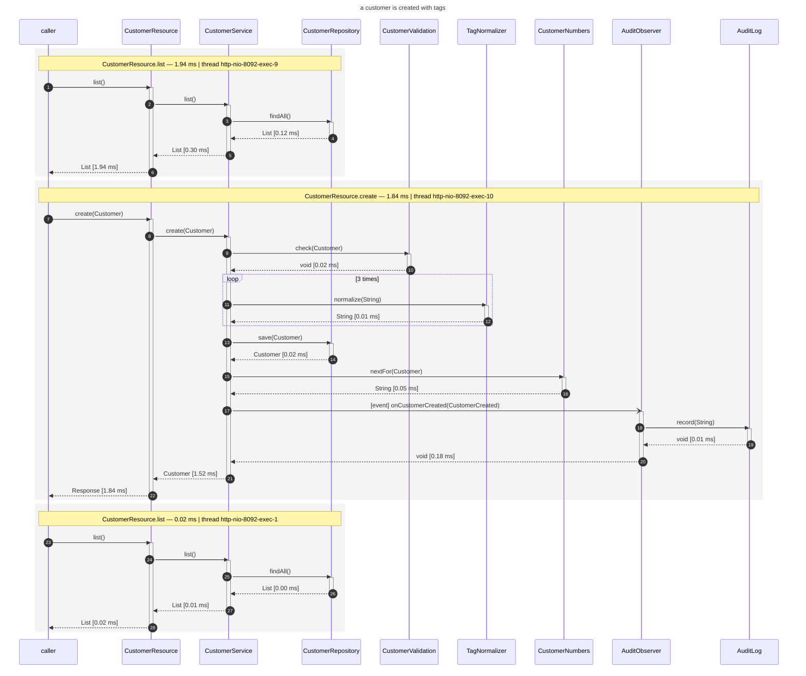
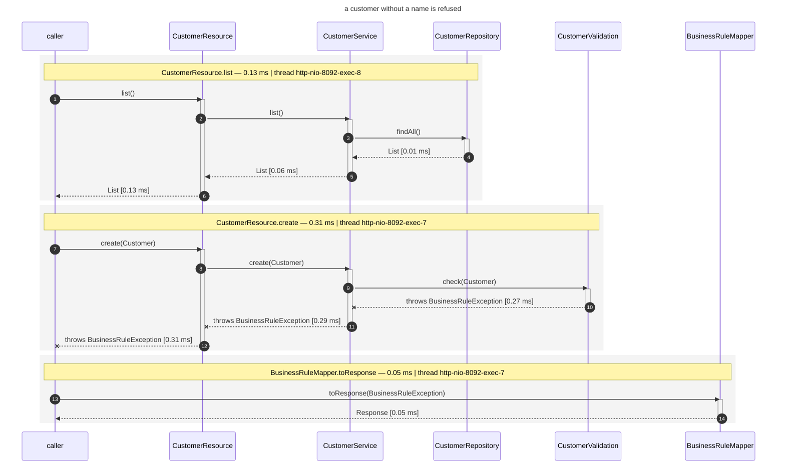
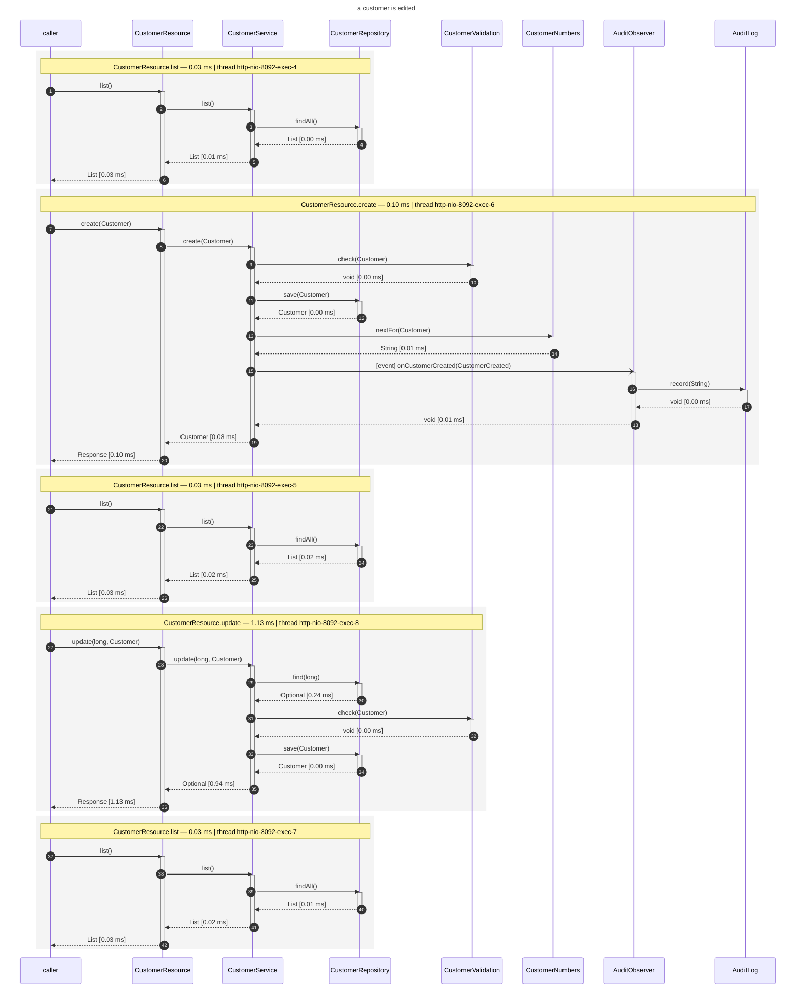
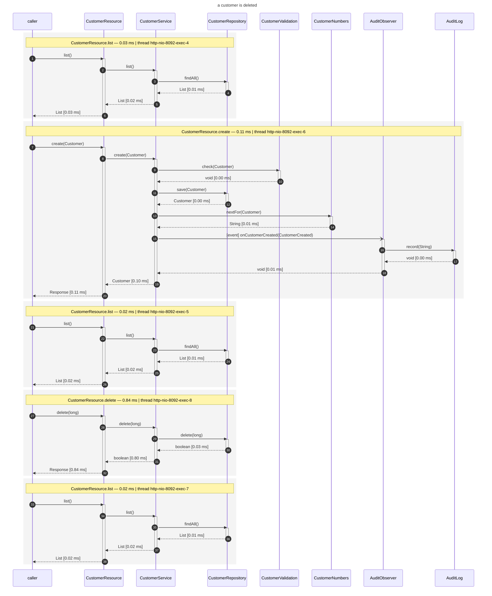

# The same demo on a Jakarta EE server

Same beans, same Angular front-end, same Playwright suite as
[the Quarkus example](../cdi-flow-examples-quarkus-crud) — deployed to a **Jakarta EE server**: TomEE,
which is Tomcat with OpenWebBeans for CDI, CXF for Jakarta REST and Johnzon for JSON. It runs embedded,
started from a `main` method, so the example needs no installation while still being the deployment it
looks like.

It exists to show that the addon is used the same way either side of that choice, and that what it
records does not depend on it.

```bash
mvn -f ../../pom.xml clean install -DskipTests   # once - see below

./run.sh                      # build, drive the use-cases, and say where the diagrams are
./run.sh --format plantuml    # the same flows as .puml instead
./run.sh --no-title           # without the use-case as the diagram's title
open target/flow-diagrams/use-cases.md
```

**The one-off first**: this example is built standalone rather than as part of the reactor, so it
resolves `dynamic-cdi-flow-renderer` and `cdi-flow-jaxrs` from your local repository - and the addon
is not released anywhere, so nothing puts them there but a build of this repository. Skip that
install and the run fails on an unresolvable dependency before it ever starts.

Besides a JDK and Maven, `./run.sh` needs **Node.js with pnpm** and the Playwright browsers it
drives.

## What this application does for cdi-flow

**Two dependencies** — the addon and the filter that reads the use-case header:

```xml
<dependency>
    <groupId>org.os890.cdi.uml</groupId>
    <artifactId>dynamic-cdi-flow-renderer</artifactId>
</dependency>
<dependency>
    <groupId>org.os890.cdi.uml</groupId>
    <artifactId>cdi-flow-jaxrs</artifactId>
</dependency>
```

**Three defaults**, set in
[`CrudApplication`](src/main/java/org/os890/cdi/uml/examples/jakartacrud/CrudApplication.java) before
the server starts — where the diagrams go, which beans to record, and the licence header every
generated file carries:

```java
setUnlessConfigured("cdi-flow.output-directory", "target/flow-diagrams");
setUnlessConfigured("cdi-flow.include-pattern", "org\\.os890\\.cdi\\.uml\\.examples\\..*");
setUnlessConfigured("cdi-flow.file-header", "Licensed under the Apache License, Version 2.0");
```

System properties rather than `META-INF/microprofile-config.properties`, because this server ships no
MicroProfile Config implementation — the addon then reads system properties and environment variables,
which is exactly what it falls back to. They are set only when nothing else says otherwise, so
`--format` and `--no-title` keep working through the environment.

**Nothing else.** No extension class, no startup hook, no interceptor binding in the sources, and —
unlike a hand-wired REST layer — nothing to register: the server finds the resources, the exception
mapper and cdi-flow's request filter by itself, and because they are CDI beans they are recorded.

The test-suite side is identical to the Quarkus example — the same nine-line fixture setting
`X-Flow-Label`, and the same four specs.

## What is different, and why

| Difference | Why |
|---|---|
| `cdi-flow.include-pattern` | a server has beans of its own — MyFaces, the CDI implementation, the REST layer — and recording those says nothing about the application. Without the pattern this run records 23 bean classes instead of 9. The Quarkus extension knows which beans belong to the application archive and needs no pattern; a full server does |
| `@ApplicationScoped` on `CustomerResource` and `BusinessRuleMapper` | `@Path` and `@Provider` are bean-defining annotations in ArC and are not in a portable container. With `bean-discovery-mode="annotated"` a class needs one, and only a bean is intercepted — so only a bean is recorded |
| `@Path("/customers")` plus an `@ApplicationPath("/api")` application | the base path belongs to the deployment rather than to the resource; the URLs the front-end calls are the same |
| `CrudApplication` exists at all | Quarkus arranges the container, the REST layer and the front-end; here a server is started and this application deployed into it, which is what a Jakarta EE application does |
| the front-end is built by `exec-maven-plugin` | Quarkus has Quinoa for that; a Jakarta build has nothing of the kind, so it runs the same two pnpm commands itself |
| OpenWebBeans pinned to the server's version | the root pom manages OpenWebBeans for the examples which bootstrap it themselves, and mixing that version into TomEE's own gets as far as a `NoSuchMethodError` while deploying |

Only the first of those is about cdi-flow, and it is the interesting one: what a build-time extension
works out for you, a portable extension has to be told.

## What the two containers record

Driving the same four use-cases through both and normalizing the timings and thread names away, the
combined diagrams come out **identical for all four**, line for line:

```
a-customer-is-created-with-tags:      IDENTICAL (3 requests)
a-customer-without-a-name-is-refused: IDENTICAL (3 requests)
a-customer-is-edited:                 IDENTICAL (5 requests)
a-customer-is-deleted:                IDENTICAL (5 requests)
```

Two very different runtimes — one resolving its beans while it builds the application, one deploying a
web application into a servlet container — and the recording says the same thing about both, down to
the line. The only trace of the difference is in the thread names: `executor-thread-2` on Quarkus,
`http-nio-8092-exec-4` here.

That includes the exception path, which is where they used to differ. An earlier version of this
example ran on RESTEasy, which calls an exception mapper through the raw
`ExceptionMapper#toResponse(Throwable)` bridge method — so the diagram said `toResponse(Throwable)`
there and `toResponse(BusinessRuleException)` on Quarkus. CXF calls the typed method and the difference
disappeared. The recording was right both times: it says what actually happened, which is the point of
recording rather than drawing.

## The recorded diagrams

Copied out of `target/flow-diagrams/` as they were written, recorded on TomEE. Put them next to [the Quarkus ones](../cdi-flow-examples-quarkus-crud/README.md#the-recorded-diagrams): all four are identical line for line, thread names aside.

### a customer is created with tags

The service validates the customer, normalizes each tag, stores it, asks for a customer-number and fires an event - which is where the audit observer joins the chain. The list before it is the front-end loading the table. 3 requests, one block each.



### a customer without a name is refused

The validation refuses it, and the exception travels back out through every frame it passed before the mapper turns it into a 422. 3 requests, one block each.



### a customer is edited

The list, the customer it creates to have something to edit, the list again, the update, and the list showing the new e-mail. 5 requests, one block each.



### a customer is deleted

The same shape, ending in a delete - and the list afterwards no longer holds the row. 5 requests, one block each.


