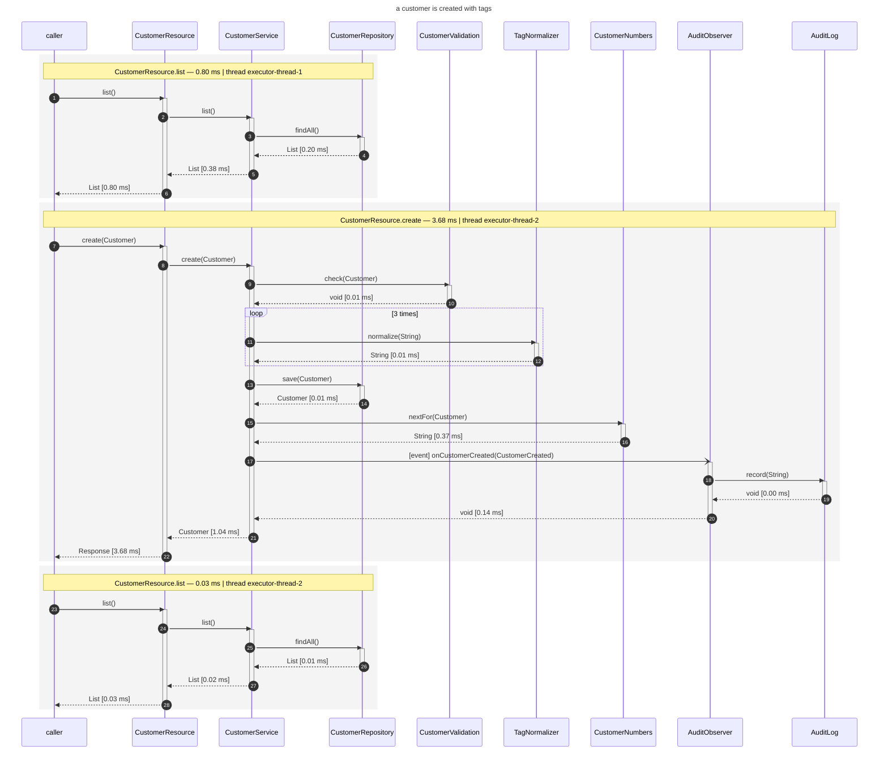
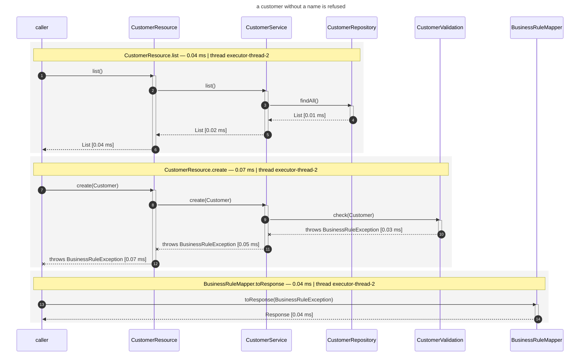
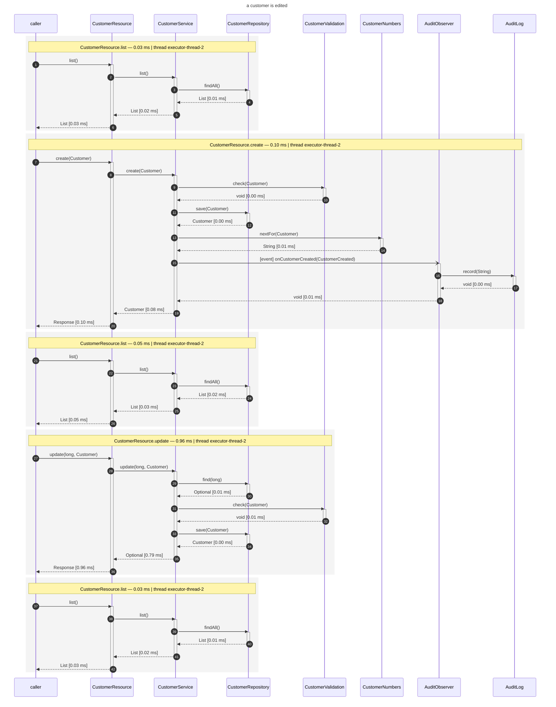
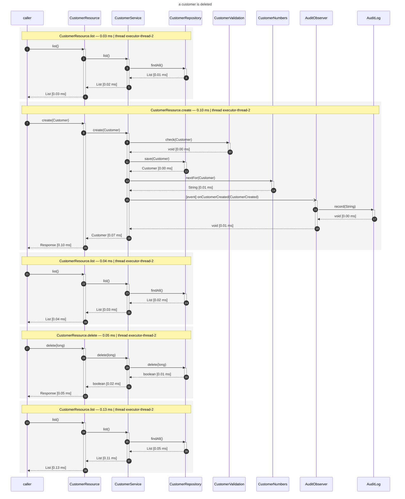

# cdi-flow in a Quarkus application, end to end

A CRUD application — Quarkus backend, Angular front-end, one process — whose use-cases are driven
through a real browser while it records a sequence diagram of each of them.

```bash
mvn -f ../../pom.xml clean install -DskipTests   # once - see below

./run.sh                      # build, drive the use-cases, and say where the diagrams are
./run.sh --format plantuml    # the same flows as .puml instead
./run.sh --no-title           # without the use-case as the diagram's title
open target/flow-diagrams/use-cases.md
```

That is the whole thing. The script builds, runs the suite and prints a path; everything about
recording is in the addon.

**The one-off first**: this example is built standalone rather than as part of the reactor, so it
resolves `cdi-flow-quarkus` from your local repository - and the addon is not released anywhere, so
nothing puts it there but a build of this repository. Skip that install and the run fails on an
unresolvable dependency before it ever starts.

Besides a JDK and Maven, `./run.sh` needs **Node.js with pnpm** and the Playwright browsers it
drives.

## What the application does for it

**One dependency**, in [`pom.xml`](pom.xml):

```xml
<dependency>
    <groupId>org.os890.cdi.uml</groupId>
    <artifactId>cdi-flow-quarkus</artifactId>
</dependency>
```

**Two lines of configuration**, in [`application.properties`](src/main/resources/application.properties):

```properties
cdi-flow.enabled=true
cdi-flow.output-directory=target/flow-diagrams
```

`enabled` is needed because this is a *packaged* application — a production build records nothing
unless it is told to. In dev-mode and in tests the extension needs neither line.

**Nothing in the sources.** No annotation, no interceptor, no startup hook, no include-pattern: the
extension attaches the recorder to the beans of this application while Quarkus builds it, and arms
it when the application starts.

## What the test-suite does for it

One fixture, [`e2e/tests/flow.ts`](e2e/tests/flow.ts) — every request of a test carries the name of
that test:

```ts
export const test = base.extend({
  context: async ({ context }, use, testInfo) => {
    await context.setExtraHTTPHeaders({ 'X-Flow-Label': testInfo.title });
    await use(context);
  },
});
```

The addon's request-filter reads that header, and everything recorded while the request is handled is
filed under that use-case. A test may add a `description` annotation, which ends up above its diagram
in the generated document.

One application serves the whole suite: there is no restart between use-cases, and no output
directory to juggle.

## What comes out

```
target/flow-diagrams/
├── use-cases.md                        every use-case, described, with its diagram inline
├── a-customer-is-created-with-tags/
│   ├── use-case.mmd                    the whole use-case: one block per request
│   ├── README.md                       the chains it is made of, and how often each occurred
│   └── CustomerResource_create_….mmd   one file per distinct chain
├── a-customer-without-a-name-is-refused/
├── a-customer-is-edited/
└── a-customer-is-deleted/
```

The beans are arranged to show what the recorder can do:

| In the diagram | Where it comes from |
|---|---|
| a nested chain, four levels deep | `CustomerResource` → `CustomerService` → the beans it calls |
| `loop 3 times` | `TagNormalizer`, called once per tag |
| `-)` with `[event]` | `AuditObserver`, observing the synchronous `CustomerCreated` event |
| `--x throws BusinessRuleException` | a customer without a name, refused by `CustomerValidation` |
| several blocks in one diagram | a use-case which lists, creates and then updates |

## The recorded diagrams

Copied out of `target/flow-diagrams/` as they were written - nothing here is hand-drawn, and only the timings differ from run to run.

### a customer is created with tags

The service validates the customer, normalizes each tag, stores it, asks for a customer-number and fires an event - which is where the audit observer joins the chain. The list before it is the front-end loading the table. 3 requests, one block each.



### a customer without a name is refused

The validation refuses it, and the exception travels back out through every frame it passed before the mapper turns it into a 422. 3 requests, one block each.



### a customer is edited

The list, the customer it creates to have something to edit, the list again, the update, and the list showing the new e-mail. 5 requests, one block each.



### a customer is deleted

The same shape, ending in a delete - and the list afterwards no longer holds the row. 5 requests, one block each.


## Running it differently

```bash
./run.sh --format plantuml       # the same flows in the other notation, as .puml
./run.sh --no-title              # leave the use-case off the diagrams
./run.sh --grep "deleted"        # anything else is handed to Playwright
mvn quarkus:dev                  # dev-mode records too, with no configuration at all
```

`--format` sets nothing but `cdi-flow.output-format` for the run: which calls are recorded, how they
nest and how they fold is decided by the same code either way, and the combined diagram of a use-case
is stitched in the notation asked for - `group` blocks instead of `rect` ones. The generated document
inlines whichever it is.

In dev-mode the diagrams appear as you click through <http://localhost:8091>, and every reload keeps
recording into the same use-case directories.
